# Marketing Measurement & Incrementality Analysis in DACH Region

### Simulating a Measurement Implementation Expert workflow for a privacy-first advertising environment

**Dataset:** 3 years of simulated daily marketing data · 3,288 observations · 3 DACH markets  
**Methods:** Conversion Lift · Incrementality Analysis · Statistical Significance Testing · Marketing Mix Modeling · SQL Analytics · ROI Optimization

---

## Key Results

| Market | ROI | ROAS | Conversion Lift | StatSig | Budget Change |
|--------|-----|------|-----------------|---------|---------------|
| 🇨🇭 Switzerland | **1,144.3%** | 19.14x | +50.0% | Yes | +22.8% |
| 🇦🇹 Austria | 597.8% | 10.74x | +15.8% | No | -3.9% |
| 🇩🇪 Germany | 290.6% | 6.00x | -16.4% | No | -18.9% |

---

## Business Context

Privacy changes across Europe have fundamentally shifted how digital advertising
performance is measured. With user-level tracking becoming increasingly limited,
marketers can no longer rely solely on traditional attribution models to understand
whether their campaigns are driving real business impact.

This project simulates the role of a **Measurement Implementation Expert** supporting
a mid-size e-commerce company operating across the **DACH region**. The client has
been running Google Ads campaigns consistently, but leadership is questioning whether
the observed conversions are truly incremental, or whether users would have converted
anyway, with or without advertising exposure.

---

## Business Problem

Three core questions drive this analysis:

- Are Google Ads campaigns generating **incremental** conversions, or just capturing
  demand that already existed?
- Which marketing channels contribute most to business outcomes across the DACH region?
- How should budgets be allocated across **Germany, Austria and Switzerland** to
  maximize return?

---

## Why the DACH Region Is Particularly Interesting

| | 🇩🇪 Germany | 🇦🇹 Austria | 🇨🇭 Switzerland |
|---|---|---|---|
| **Ad receptiveness** | Lower | Medium | Higher |
| **Digital engagement** | Moderate | Moderate | Strong |
| **Purchasing power** | High | Medium | Very high |
| **Role in this analysis** | Scale market | Mid-tier | Efficiency leader |

Skepticism toward advertising is a shared DACH trait, but its intensity varies
significantly by country. **German consumers** are well-documented in their preference
for transparent, fact-based communication and their resistance to persuasion-driven ads,
a pattern that shows up directly in lower CTRs, higher CPAs and, in this analysis,
a **negative Conversion Lift**. **Switzerland**, despite sharing the German language
in its largest region, shows stronger digital engagement and significantly higher
purchasing power, making it the highest-ROI market in the analysis.

---

## Analysis Overview

| Step | Method | Business Purpose |
|------|--------|-----------------|
| 1. EDA | KPI calculation, seasonality analysis | Understand baseline performance |
| 2. Conversion Lift | Controlled experiment, Test vs Control | Isolate true incremental impact |
| 3. Statistical Validation | Two-proportion Z-test | Confirm results are not random |
| 4. MMM | Adstock + OLS regression | Estimate long-term channel contribution |
| 5. SQL Analytics | CTEs, Window Functions, CASE WHEN | Surface performance insights |
| 6. Budget Optimization | ROI-based reallocation | Translate findings into action |

---

## Exploratory Data Analysis

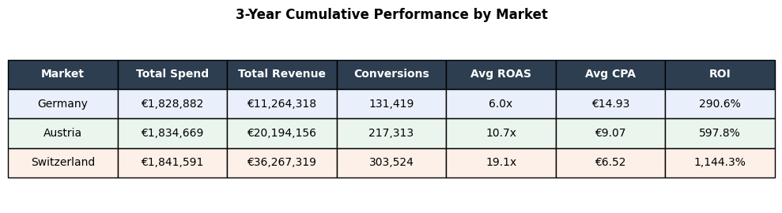
*3-year cumulative performance: Switzerland generates 3.2x more revenue than Germany
with the same spend. ROI calculated on total marketing spend across all channels.*

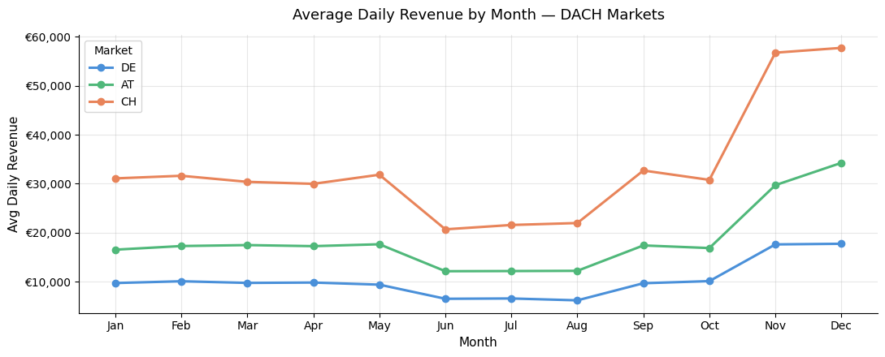
*Q4 drives the strongest revenue across all markets. Switzerland peaks at nearly €58,000/day in December.*

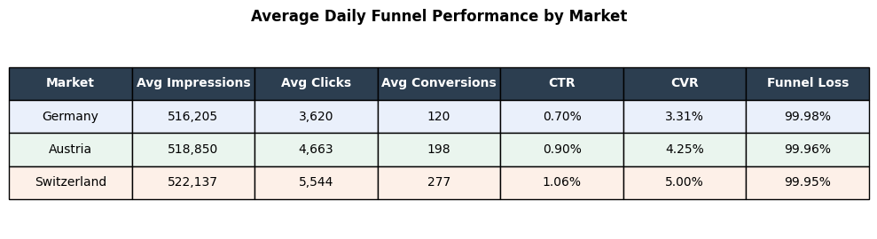
*Germany's CVR (3.31%) is 51% below Switzerland (5.00%), compounding into large CPA and ROI gaps.*

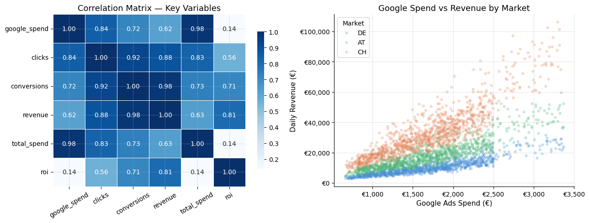
*Google spend correlates strongly with traffic (0.97) but weakly with revenue (0.30). ROI is largely independent of spend (0.14).*

---

## Conversion Lift Study

A user-level experiment was simulated across **10,000 users** to isolate the true
incremental impact of ad exposure. Users were randomly assigned to Test and Control
groups, with country-specific conversion rates reflecting real behavioral differences.

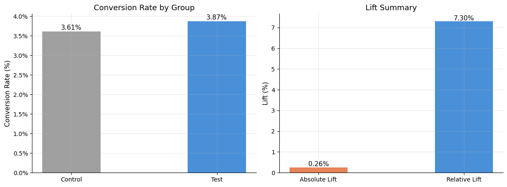
*Overall: Test group converted at 3.87% vs 3.61% control. Relative Lift of 7.3% across DACH.*

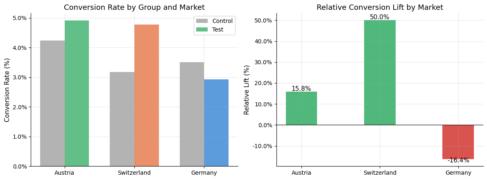
*Switzerland: +50.0% lift. Austria: +15.8%. Germany: -16.4% — exposed users converted less than non-exposed.*

**Germany's negative lift** is a critical finding. It reflects a well-documented
behavioral pattern: German consumers who feel targeted by advertising can become
less likely to convert. This is a market where ad pressure can backfire, and where
measurement strategy needs to account for that dynamic explicitly.

---

## Statistical Significance

A two-proportion Z-test was applied to validate whether observed lift results
are statistically reliable.

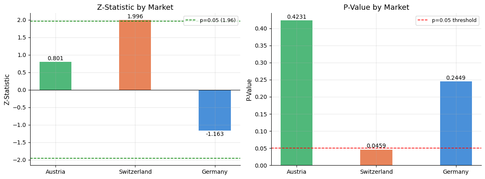
*Switzerland is the only market that crossed the significance threshold (p = 0.0459, Z = 1.996).*

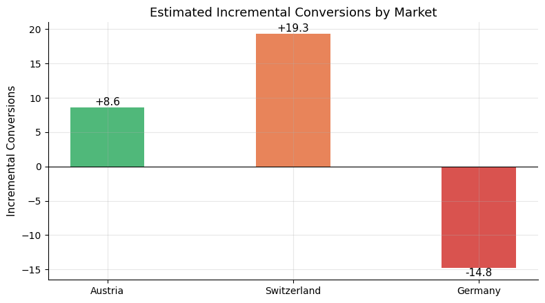
*Net incremental conversions: Switzerland +19.3, Austria +8.6, Germany -14.8.*

---

## Marketing Mix Modeling

A simplified MMM framework was built using **Adstock transformation** and **OLS
regression** to estimate long-term channel contribution to revenue.

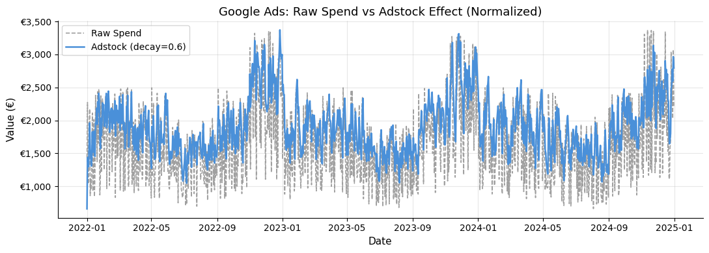
*Normalized Adstock shows advertising carry-over effect: impact persists beyond the day of exposure.*

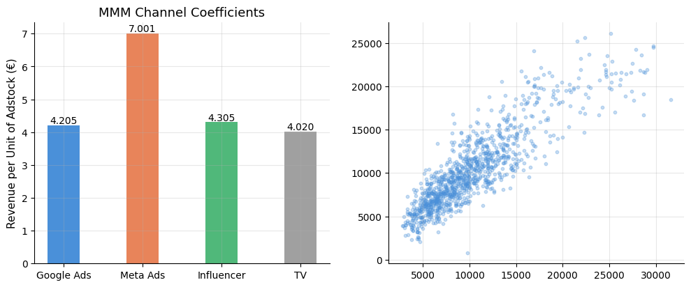
*Model R² = 0.768. Seasonality is the dominant driver. Among paid channels, Meta and Google show the strongest coefficients, with a multicollinearity caveat discussed in section 6.2.*

---

## SQL-Based Performance Analysis

Three SQL queries were run directly against the dataset using **SQLite** to surface
performance insights through aggregation, window functions and efficiency segmentation.

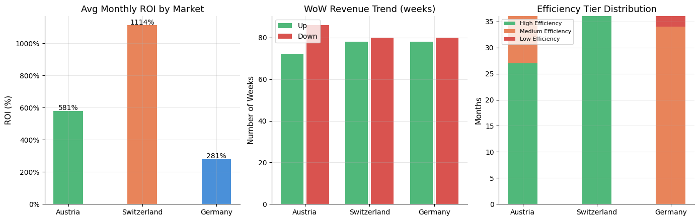

- **Query 1 (ROI Ranking):** Switzerland ranked first in **every single month** across
  36 months. Germany never ranked above third.
- **Query 2 (WoW Trend):** Switzerland shows the highest average weekly revenue growth
  (**8.2%**), Germany the lowest (**6.3%**).
- **Query 3 (Efficiency Tiers):** Switzerland operated at **High Efficiency for 100%
  of months**. Germany spent **94% of months in Medium or Low Efficiency**.

---

## ROI Analysis and Budget Optimization

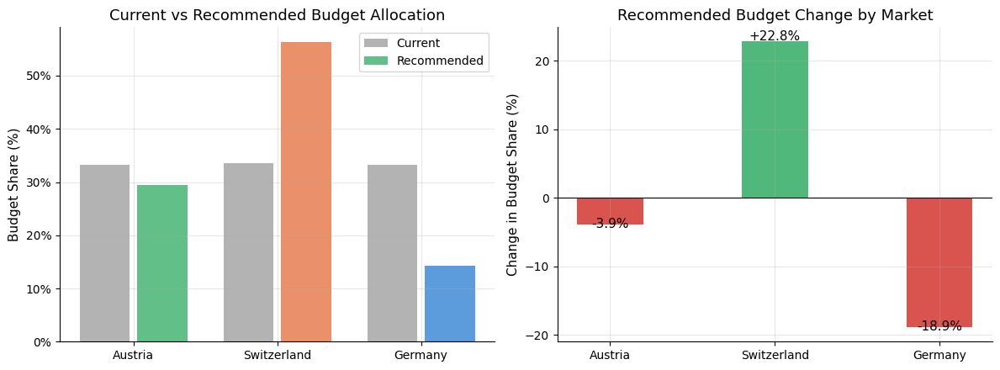
*Equal spend across markets produces vastly different returns. Switzerland's 1,144% ROI is nearly 4x Germany's 291%.*

### Recommended Reallocation

| Market | Current Share | Recommended Share | Change |
|--------|--------------|-------------------|--------|
| 🇨🇭 Switzerland | 33.5% | 56.3% | +22.8% |
| 🇦🇹 Austria | 33.3% | 29.4% | -3.9% |
| 🇩🇪 Germany | 33.2% | 14.3% | -18.9% |

Total budget remains unchanged. This is a reallocation strategy, not a spend cut.

---

## Executive Summary

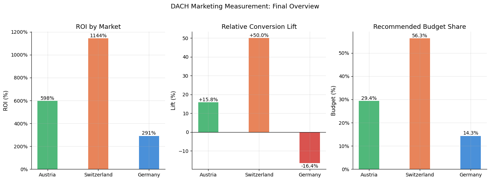

| Market | ROI | ROAS | Lift | StatSig | Efficiency | Budget |
|--------|-----|------|------|---------|------------|--------|
| 🇨🇭 Switzerland | 1,144.3% | 19.14x | +50.0%* | Yes | High 100% | +22.8% |
| 🇦🇹 Austria | 597.8% | 10.74x | +15.8% | No | High 75% | -3.9% |
| 🇩🇪 Germany | 290.6% | 6.00x | -16.4% | No | Med/Low 94% | -18.9% |

*Statistically significant at p = 0.0459.

---

## Limitations

- Dataset was simulated to reproduce realistic DACH patterns. Real advertiser
  data is confidential by nature.
- External factors such as competitor activity, pricing and macroeconomic
  conditions were not modeled.
- MMM implementation is intentionally simplified. A production deployment would
  use Bayesian approaches with stronger uncertainty quantification.
- Austria and Germany Lift results did not reach statistical significance.
  Larger sample sizes are needed to confirm directional trends.

---

## Next Steps

- Expand MMM using **Bayesian approaches** (LightweightMMM or Robyn)
- Run **geo-based lift experiments** (GeoX) to complement user-level studies
- Incorporate **offline conversion signals** and CRM data
- Build an **automated KPI monitoring dashboard**
- Increase experiment sample sizes in Austria and Germany

---

## Tools and Technologies

Python · Pandas · NumPy · Scikit-learn · SciPy · Statsmodels · Matplotlib ·
Seaborn · SQLite · Marketing Mix Modeling · Experimental Design · Incrementality Measurement · Plotly

---

## Repository Structure

```text
.
├── data/
├── notebooks/
├── images/
├── requirements.txt
└── README.md
```
