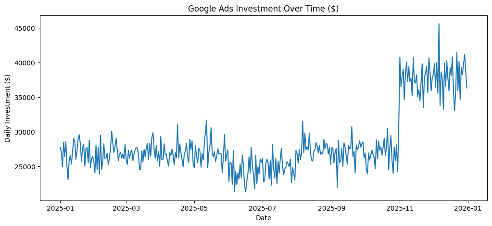
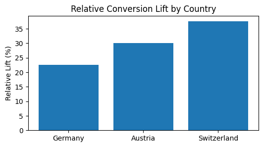
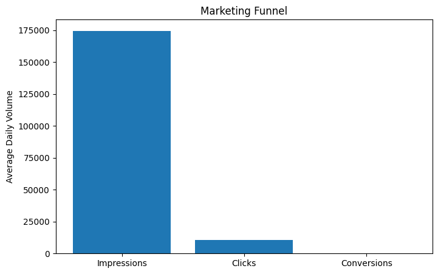
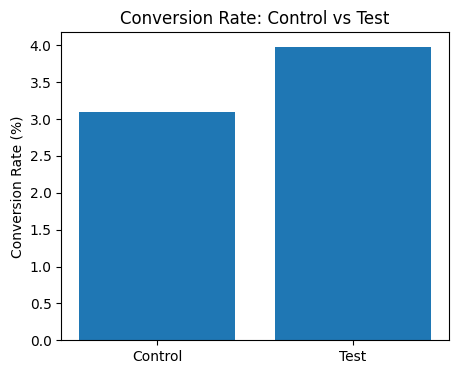
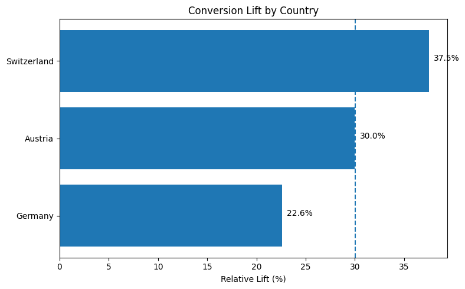
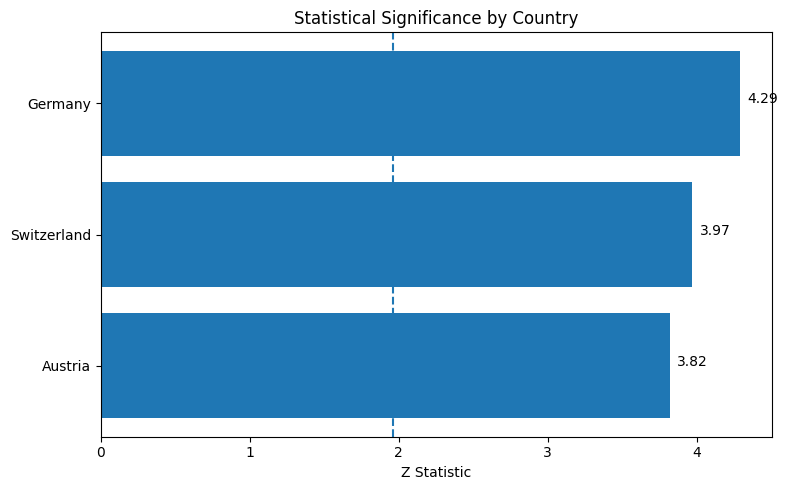
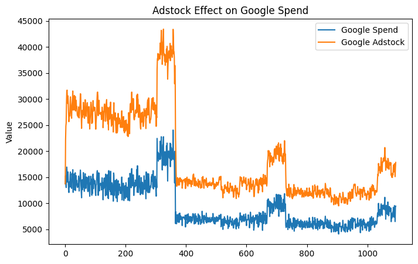
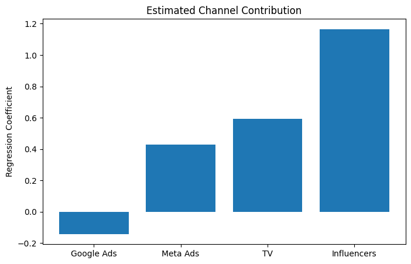
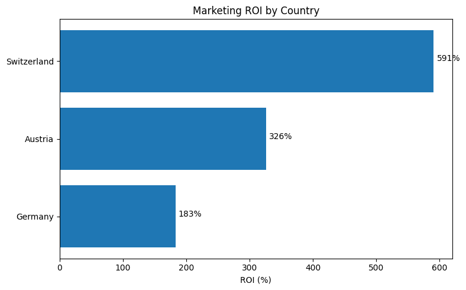
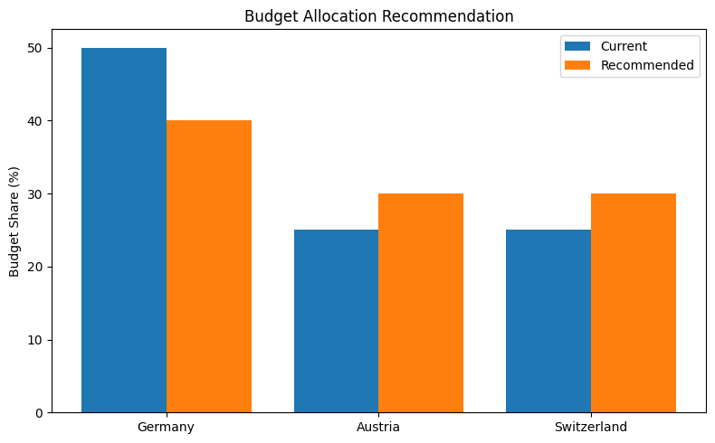

# Marketing Measurement & Incrementality Analysis – DACH Region

*Evaluating marketing effectiveness across Germany, Austria and Switzerland using Conversion Lift studies, Incrementality Analysis, Marketing Mix Modeling (MMM), and ROI optimization.*

**Dataset:** 3 years of simulated marketing performance data (1,095 daily observations)

**Techniques:** EDA, Conversion Lift, Incrementality Analysis, Hypothesis Testing, Marketing Mix Modeling (MMM), Adstock Transformation, ROI Analysis

## Key Results

- Relative Conversion Lift of **28.6%** between exposed and control groups
- Statistically significant uplift across all DACH markets (**p < 0.001**)
- Switzerland achieved the highest ROI (**590.9%**)
- Google Ads generated the strongest MMM contribution (**0.453 coefficient**)
- Regional analysis identified opportunities for budget optimization across DACH markets

---

# Business Context

Privacy changes and the gradual reduction of traditional tracking methods have increased the importance of incrementality testing and aggregate measurement frameworks.

This project simulates the work of a Measurement Implementation Expert supporting a DACH-based e-commerce company seeking to understand the true business impact of its marketing investments.

The objective is to move beyond traditional attribution and evaluate whether advertising is generating real incremental business value.

---

# Business Problem

The company wants to answer three key questions:

- Are Google Ads campaigns generating incremental conversions?
- Which marketing channels contribute most to business performance?
- How should budgets be allocated across Germany, Austria and Switzerland?

---

# Objectives

- Measure incremental business impact through Conversion Lift studies
- Validate statistical significance of marketing performance
- Compare regional effectiveness across DACH markets
- Estimate channel contribution using MMM
- Quantify ROI differences across markets
- Generate actionable budget recommendations

---

# Methodology

1. Data Preparation & Feature Engineering
2. Exploratory Data Analysis (EDA)
3. Conversion Lift & Incrementality Analysis
4. Statistical Significance Testing
5. Marketing Mix Modeling (MMM)
6. Adstock Transformation
7. Regional ROI Analysis
8. Strategic Budget Recommendation

---

# Tools & Technologies

- Python (Pandas, NumPy)
- Scikit-learn
- SciPy
- Statsmodels
- Matplotlib
- SQL
- Marketing Mix Modeling Concepts
- Experimental Design & Incrementality Measurement

---

# Exploratory Data Analysis Highlights

The exploratory analysis revealed several relevant business patterns:

- Strong relationships between clicks, conversions and revenue
- Clear seasonality effects during year-end periods
- Lower performance during summer months
- Regional differences across DACH markets
- Marketing spend alone does not explain business performance

## Daily Marketing Investment



*Figure: Daily Google Ads investment across the analysis period.*

## Revenue Seasonality



*Figure: Revenue peaks observed during November and December, likely influenced by holiday shopping periods and seasonal demand.*

### Observations

- Revenue increased substantially during Q4
- November and December generated the strongest business performance
- January and February showed a post-holiday decline
- Results suggest strong seasonal effects that should be considered when planning budgets

## Marketing Funnel



*Figure: Average progression from impressions to clicks and conversions.*

### Observations

- The largest volume reduction occurs between impressions and clicks
- Clicked users demonstrate substantially higher conversion probability
- Funnel performance highlights the importance of traffic quality rather than traffic volume alone

---

# Conversion Lift & Incrementality Analysis

Traditional attribution methods measure conversions but do not necessarily isolate the true impact generated by advertising exposure.

To estimate incremental impact, a user-level experiment was simulated using Test and Control groups.

## Results

| Group | Conversion Rate |
|---------|---------:|
| Control | 3.09% |
| Test | 3.98% |

**Absolute Lift:** 0.88%

**Relative Lift:** 28.6%



*Figure: Conversion rate comparison between exposed and non-exposed users.*

### Interpretation

The exposed group achieved a substantially higher conversion rate, indicating that advertising generated meaningful incremental conversions beyond the expected baseline.

## Regional Incrementality Analysis



*Figure: Relative Conversion Lift across DACH markets.*

### Regional Insights

- Switzerland achieved the highest lift (**37.5%**)
- Austria generated strong incremental performance (**30.0%**)
- Germany produced the lowest lift (**22.6%**) but remained strongly positive
- Results suggest country-specific optimization opportunities

---

# Statistical Significance Testing

A two-proportion Z-test was conducted to validate whether the observed uplift was statistically reliable.

### Results

- Z-statistic: **7.57**
- P-value: **< 0.001**



*Figure: Regional significance testing results.*

### Observations

- All countries exceeded the critical threshold of **1.96**
- Uplift remained statistically significant across all DACH markets
- Results provide strong evidence that observed improvements were not driven by random variation

---

# Marketing Mix Modeling (MMM)

To understand long-term channel contribution, a simplified MMM framework was developed.

The model incorporates Adstock transformation to capture delayed advertising effects.

## Adstock Transformation



*Figure: Advertising impact persists beyond the original exposure period.*

### Interpretation

Adstock demonstrates that marketing impact continues after the initial exposure. This helps explain why short-term attribution models often underestimate the true contribution of advertising activities.

## Channel Contribution



*Figure: Relative channel contribution estimated by the MMM model.*

### Results

| Channel | MMM Coefficient |
|----------|----------:|
| Google Ads | 0.453 |
| Influencers | 0.274 |
| Meta Ads | 0.036 |
| TV | -0.057 |

### Interpretation

- Google Ads generated the strongest contribution to business outcomes
- Influencer campaigns demonstrated meaningful impact
- Meta Ads contributed modestly
- TV showed limited incremental value in this simulated scenario

---

# Regional ROI Analysis



*Figure: Marketing ROI comparison across DACH markets.*

### Results

| Country | ROI |
|----------|----------:|
| Switzerland | 590.9% |
| Austria | 326.1% |
| Germany | 182.8% |

### Key Observation

Although Germany generated the largest business volume, Switzerland delivered more than **3x higher ROI**.

This suggests that market scale and marketing efficiency do not necessarily move together, reinforcing the importance of incrementality and ROI-based decision making.

---

# Strategic Budget Recommendation

The final step translates measurement results into business action.



*Figure: Current versus recommended budget allocation across DACH markets.*

### Recommendation

Based on Conversion Lift, MMM and ROI results:

- Increase investment in Switzerland
- Moderately expand investment in Austria
- Optimize spending efficiency in Germany while maintaining scale

This allocation strategy aims to maximize incremental returns while preserving market coverage.

---

# Business Impact

This project demonstrates how modern measurement frameworks combine:

- Experimentation
- Incrementality Testing
- Statistical Validation
- Marketing Mix Modeling
- ROI Analysis

to support budget allocation decisions in privacy-focused environments.

The workflow closely reflects real-world measurement challenges faced by advertisers operating in a privacy-first ecosystem.

---

# Limitations

- The dataset was simulated for educational purposes.
- External factors such as competitor activity, pricing changes and macroeconomic conditions were not modeled.
- The MMM implementation was intentionally simplified to focus on core measurement concepts.

---

# Next Steps

- Expand MMM using Bayesian approaches and LightweightMMM
- Incorporate additional media channels and offline campaigns
- Simulate budget optimization scenarios
- Build an interactive stakeholder dashboard
- Automate KPI monitoring and reporting workflows

---

# Repository Structure

```text
.
├── data
├── notebooks
├── images
├── requirements.txt
└── README.md
```

---

# Strategic Perspective

This project was intentionally designed to simulate the responsibilities of a Measurement Implementation Expert working with DACH advertisers.

Beyond technical modeling, the analysis emphasizes business interpretation, regional differences, statistical validation and the translation of analytical findings into actionable recommendations.

The goal was not only to measure marketing performance, but to determine whether advertising investments generated real incremental business value.

---

# Conclusion

This project demonstrates how modern marketing measurement extends beyond traditional attribution models.

By combining Conversion Lift studies, statistical significance testing, Marketing Mix Modeling and ROI analysis, it was possible to estimate the true incremental impact of marketing investments across DACH markets.

### Key Findings

- **28.6% Relative Conversion Lift**
- **Statistically significant uplift across all markets**
- **Google Ads as the strongest contributing channel (0.453 MMM coefficient)**
- **Switzerland achieving the highest ROI (590.9%)**
- **Clear opportunities for regional budget optimization**

Most importantly, the project shows how measurement frameworks can support data-driven budget allocation decisions and help marketers focus investments where incremental business impact is highest.
