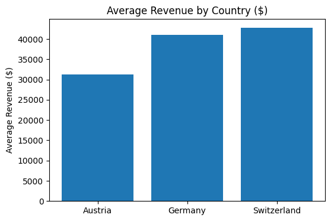
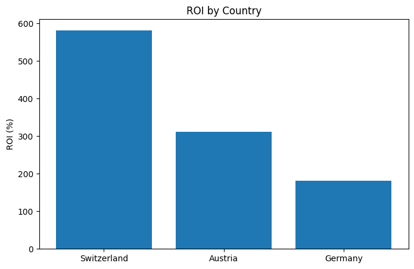

# Marketing Measurement & Incrementality Analysis - DACH Region
*Evaluating marketing effectiveness across Germany, Austria and Switzerland using Conversion Lift studies, Marketing Mix Modeling (MMM), and ROI analysis.*

**Dataset:** 3 years of simulated marketing performance data (1,095 daily observations)

**Techniques:** EDA, Conversion Lift, Incrementality Analysis, Hypothesis Testing, Marketing Mix Modeling (MMM), Adstock Transformation, ROI Analysis

**Key Results**
- Conversion Lift of **28.6%** between exposed and control groups
- Statistically significant uplift across all DACH markets
- Switzerland achieved the highest marketing efficiency (ROI)
- Google Ads showed the strongest contribution in the MMM model
- Regional differences highlighted opportunities for budget optimization

---

## Business Context

Privacy changes and the gradual reduction of traditional tracking methods have increased the importance of incrementality testing and aggregate measurement frameworks.

This project simulates the work of a Measurement Implementation Expert supporting a DACH-based e-commerce company that wants to understand the true business impact of its marketing investments.

The objective is to move beyond traditional attribution and evaluate whether marketing activities are generating real incremental business value.

---

## Business Problem

The company wants to answer three key questions:

- Are Google Ads campaigns generating incremental conversions?
- Which marketing channels contribute most to business performance?
- How should marketing budgets be allocated across DACH markets?

---

## Objectives

- Measure incremental business impact through Conversion Lift studies
- Validate statistical significance of marketing performance
- Compare regional performance across Germany, Austria and Switzerland
- Estimate channel contribution using Marketing Mix Modeling
- Quantify ROI differences across markets
- Generate strategic recommendations for budget allocation

---

## Methodology

1. Data Preparation & Feature Engineering
2. Exploratory Data Analysis (EDA)
3. Conversion Lift & Incrementality Analysis
4. Statistical Significance Testing
5. Marketing Mix Modeling (MMM)
6. Adstock Transformation
7. Regional ROI Analysis
8. Strategic Recommendations

---

## Tools & Technologies

- Python (Pandas, NumPy)
- Scikit-learn
- SciPy (Hypothesis Testing)
- Statsmodels
- Matplotlib
- Seaborn
- SQL (BigQuery-style syntax)
- Marketing Mix Modeling concepts
- Experimental Design & Incrementality Measurement

---

## Exploratory Data Analysis Highlights

The exploratory analysis revealed several relevant patterns:

- Strong positive relationship between clicks, conversions and revenue.
- Clear seasonality patterns with revenue peaks during November and December.
- Lower performance during summer months, suggesting seasonal demand effects.
- Significant variation across DACH markets.
- Marketing spend alone does not fully explain revenue performance, reinforcing the need for incrementality analysis.

### Daily Marketing Investment


*Figure: Daily Google Ads investment across the analysis period.*

### Revenue by Country



*Figure: Average revenue performance across DACH markets.*

### Monthly Revenue Seasonality


*Figure: Revenue peaks observed during holiday periods and year-end shopping seasons.*

### Marketing Funnel Overview


*Figure: Average user progression through the marketing funnel.*

---

## Conversion Lift & Incrementality Analysis

Traditional attribution methods often measure total conversions, but they do not isolate whether those conversions happened because of advertising.

To estimate true marketing impact, a controlled experiment was simulated using Test and Control groups.

### Results

| Group | Conversion Rate |
|---------|---------:|
| Control | 3.09% |
| Test | 3.98% |

**Absolute Lift:** 0.88%

**Relative Lift:** 28.6%

### Interpretation

The exposed group achieved a substantially higher conversion rate than the control group, indicating that advertising generated incremental conversions beyond the expected baseline.

### Conversion Lift Results


*Figure: Comparison between Test and Control groups.*

---

## Statistical Significance Testing

A two-proportion Z-test was conducted to validate whether the observed uplift was statistically significant.

### Results

- Z-statistic: 7.57
- P-value: < 0.001

The results indicate strong statistical evidence that the observed uplift is not explained by random variation.

Regional analysis confirmed statistically significant lift across Germany, Austria and Switzerland.

---

## Marketing Mix Modeling (MMM)

To understand long-term channel contribution, a simplified Marketing Mix Model was developed.

The analysis incorporated Adstock transformation to capture the delayed effect of advertising investments.

### Adstock Example


*Figure: Advertising impact persists beyond the original exposure period.*

### Channel Contributions

| Channel | Coefficient |
|---------|---------:|
| Google Ads | 0.453 |
| Influencers | 0.274 |
| Meta Ads | 0.036 |
| TV | -0.057 |

### Interpretation

- Google Ads generated the strongest business contribution.
- Influencer campaigns demonstrated meaningful incremental impact.
- Meta Ads showed a smaller contribution.
- TV produced limited incremental value in this simulated environment.

### MMM Results


*Figure: Relative channel contribution estimated by the MMM model.*

---

## Regional ROI Analysis

Regional performance revealed meaningful differences across DACH markets.

| Country | ROI |
|---------|---------:|
| Switzerland | 590.9% |
| Austria | 326.1% |
| Germany | 182.8% |

### Interpretation

- Switzerland achieved the highest efficiency and return on investment.
- Germany generated the largest conversion volume due to market size.
- Austria showed balanced performance between scale and efficiency.

### ROI by Country



*Figure: ROI comparison across DACH markets.*

---

## Business Impact

This project demonstrates how modern measurement frameworks combine:

- Experimentation
- Incrementality Testing
- Statistical Validation
- Marketing Mix Modeling
- ROI Analysis

to support marketing investment decisions in privacy-focused environments.

The methodology closely reflects the type of measurement challenges faced by large advertisers using Google Ads.

---

## Limitations

- The dataset was simulated for educational purposes.
- External factors such as competition, pricing changes and macroeconomic conditions were not modeled.
- The MMM implementation was intentionally simplified for learning purposes.

---

## Next Steps

- Expand MMM using Bayesian approaches and LightweightMMM.
- Incorporate additional media channels and offline campaigns.
- Perform budget optimization simulations.
- Build an interactive dashboard for marketing stakeholders.
- Implement automated KPI monitoring workflows.

---

## Repository Structure

```text
.
├── data
├── notebooks
├── images
├── requirements.txt
└── README.md
```

---

## Strategic Perspective

This project was intentionally designed to simulate the responsibilities of a Measurement Implementation Expert working with DACH advertisers.

Beyond technical modeling, the analysis emphasizes business interpretation, regional differences, statistical validation and communication of actionable insights to decision-makers.

The goal was not only to measure performance, but to understand whether marketing investments are truly generating incremental business value.

---

## Conclusion

This project demonstrates how modern marketing measurement goes beyond traditional attribution models.

By combining Conversion Lift studies, statistical significance testing, Marketing Mix Modeling and ROI analysis, it was possible to estimate the true incremental impact of marketing investments across DACH markets.

The results indicate that advertising generated meaningful incremental value, with Google Ads emerging as the strongest contributing channel and Switzerland achieving the highest marketing efficiency.

Most importantly, the project illustrates how data-driven measurement frameworks can support more informed budget allocation decisions in privacy-focused marketing environments.
